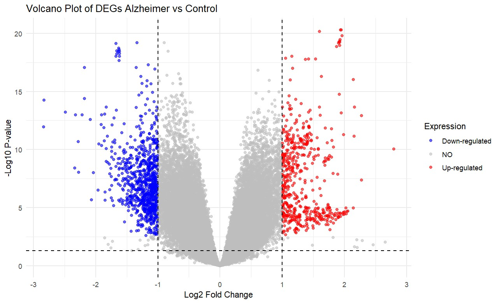
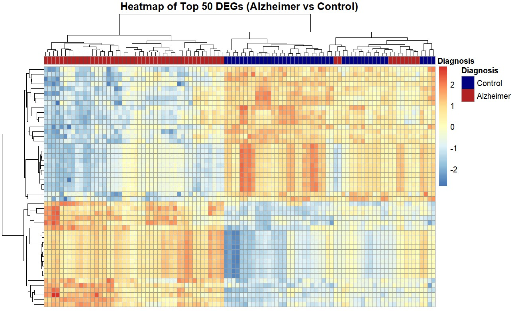
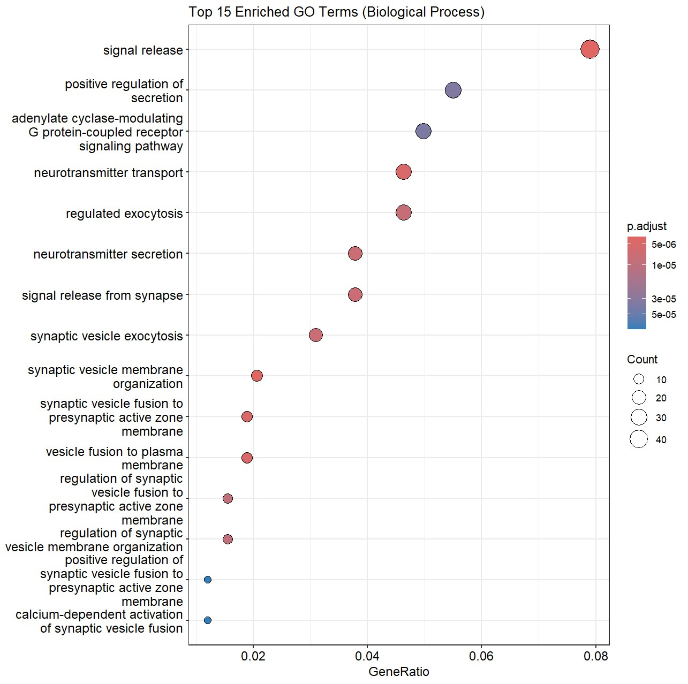
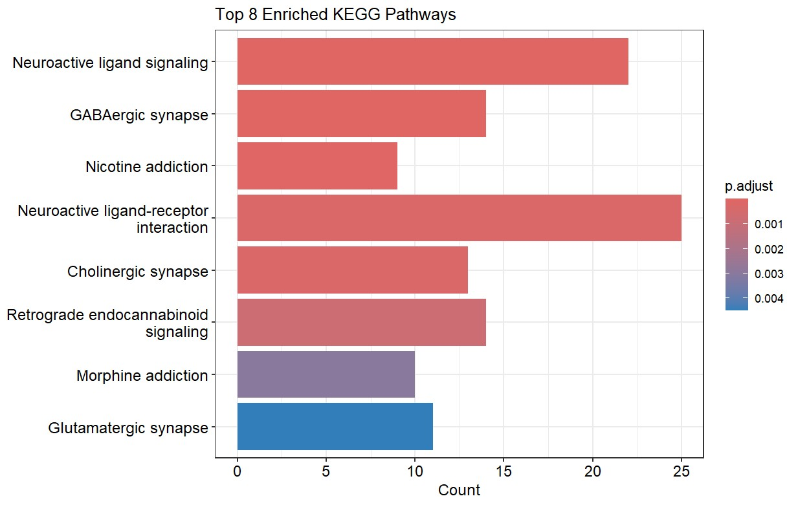
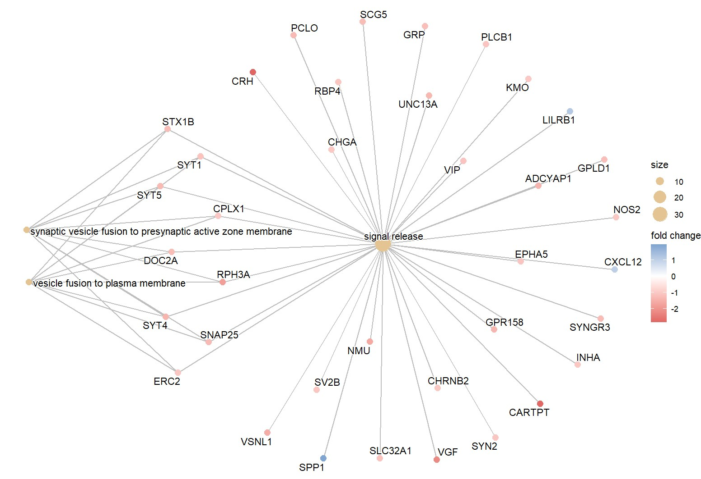

# Analisis Transcriptomics dan Pengayaan Jalur Biologis pada Pasien Alzheimer's Disease

## 1. Pendahuluan

### 1.1. Latar Belakang
Penyakit degeneratif saraf yang terkait usia telah mempengaruhi lebih dari 36 juta orang. Salah satu penyebab utamanya adalah penyakit Alzheimer (AD) yang sering muncul secara diam-diam dan menyebabkan penurunan fungsi kognitif serta fungsi fisik secara progresif. 

Proses degenerasi saraf melibatkan jaringan gen dan jalur biologis yang saling berinteraksi secara kompleks. Karena kerumitan tersebut, penggunaan pendekatan transkriptomik dapat mempermudah pemahaman mengenai gambaran perubahan molekuler yang terjadi pada pasien AD. Pemahaman yang lebih baik ini sangat penting karena dapat membantu tenaga medis dalam mendiagnosis dan memberikan perawatan yang lebih tepat.

Oleh karena itu, pendekatan bioinformatika sangat diperlukan untuk mencari biomarker spesifik dari penyakit Alzheimer dan mengeksplorasi peran biologisnya di dalam tubuh pasien.

### 1.2. Problem Statement
Sekarang, belum sepenuhnya dipahami gen-gen spesifik dan jalur biologis apa saja yang mengalami disregulasi signifikan pada jaringan otak ketika seseorang terpapar AD.

### 1.3. Tujuan Penelitian
1. Mengidentifikasi *Differentially Expressed Genes* (DEGs) antara sampel pasien AD dan kontrol.
2. Memetakan DEGs tersebut ke dalam *Gene Ontology* (GO) dan KEGG *pathways* untuk menemukan proses biologis utama yang terdampak.
3. Memvisualisasikan jejaring interaksi antara gen-gen kunci dan jalur biologis untuk memetakan gen *master regulator* dalam patologi AD.

## 2. Metode

### 2.1. Sumber Data & Sampel
Dalam penelitian ini, penulis menggunakan dataset dari database NCBI GEO berjudul *Dementia Comparison: VaD vs. AD vs. Controls* dengan ID Aksesi **GSE122063** dengan platform *microarray* yang digunakan dataset ini adalah Agilent -039494 SurePrint G3 Human GE v2 8x60K (**GPL16699**). Dataset ini berisi sampel jaringan otak yang terdiri dari 56 sampel pasien *Alzheimer's Disease* (AD), 36 sampel pasien *Vascular Dementia* (VD), dan 44 sampel kontrol sehat. Namun, untuk menjawab tujuan spesifik penelitian ini, dilakukan penyaringan sampel di mana kelompok VD dieksklusi. 

### 2.2. Prapemrosesan & Anotasi
Matriks ekspresi diekstraksi menggunakan *package* `GEOquery` di lingkungan komputasi R. Pengecekan distribusi data dilakukan untuk memastikan perlunya transformasi *log2*; nilai ekspresi yang bernilai nol atau kurang diubah menjadi *Not a Number* (NaN) sebelum ditransformasi. Anotasi ID Probe menjadi *Gene Symbol* dan *Entrez ID* dilakukan secara langsung dengan mengekstrak data fitur bawaan (*feature data*) dari platform Agilent, tanpa menggunakan *package* anotasi eksternal. Data kemudian dibersihkan dengan menghapus probe yang tidak memiliki *Gene Symbol*. Untuk menangani duplikasi probe yang memetakan ke gen yang sama, probe dengan nilai *p-value* terkecil (paling signifikan) dipertahankan untuk analisis hilir.

### 2.3. Analisis Diferensial (DEA)
Identifikasi *Differentially Expressed Genes* (DEGs) antara kelompok Alzheimer dan kelompok kontrol dilakukan menggunakan *package* `limma`. Model linier disesuaikan untuk setiap gen, diikuti dengan perhitungan statistik menggunakan metode *Empirical Bayes* untuk memoderasi *standard error*. Kriteria signifikansi statistik untuk menentukan DEGs ditetapkan pada nilai *Adjusted P-Value* (FDR - *False Discovery Rate*) < 0.05 dan nilai absolut *Log2 Fold Change* (|logFC|) > 1.

### 2.4. Analisis Pengayaan Fungsi (Functional Enrichment)
Analisis pengayaan *Gene Ontology* (GO) kategori *Biological Process* dan KEGG *Pathway* dilakukan menggunakan *package* `clusterProfiler` (*p-value* < 0.05). Guna mencegah bias statistik, *background universe* dibatasi secara spesifik hanya pada gen yang terdeteksi oleh platform Agilent. Selanjutnya, interaksi kompleks antara gen-gen signifikan dan jalur biologis divisualisasikan menggunakan fungsi `cnetplot` (*Gene-Concept Network*). Pembuatan jejaring ini mengintegrasikan nilai *Log2 Fold Change* untuk menampilkan arah regulasi ekspresi gen secara serentak, sekaligus mengidentifikasi gen-gen sentral (*hub genes*) dalam patologi Alzheimer.

## 3. Hasil dan Interpretasi

### 3.1. Profil Ekspresi Gen Diferensial (DEGs)
Berdasarkan kriteria ketat (*Adjusted P-Value* < 0.05 dan |logFC| > 1), terdapat total 1.041 DEGs. Dari jumlah tersebut, sebanyak 380 gen mengalami *upregulation* (peningkatan ekspresi), dan 661 gen mengalami *downregulation* (penurunan ekspresi) pada pasien Alzheimer.
Distribusi signifikansi dan lipatan perubahan ekspresi (*fold change*) secara global divisualisasikan melalui *Volcano Plot* (Gambar 3.1.1). Pemisahan profil transkriptomik yang sangat kontras antara kelompok AD dan kontrol juga terlihat jelas pada *Heatmap* dari 50 gen paling signifikan (Gambar 3.1.2), yang menunjukkan pola *clustering* yang membedakan keadaan patologis dan fisiologis normal secara tegas.

**Interpretasi:** Pada *Volcano plot* di atas, titik-titik yang berada di sisi kanan atas (*logFC* positif yang tinggi dan *p-value* signifikan) merepresentasikan gen-gen yang mengalami *upregulation* pada jaringan pengidap AD. Sebaliknya, titik-titik di sisi kiri atas merepresentasikan gen-gen yang mengalami *downregulation*. Gen-gen ini merupakan kandidat biomarker yang potensial membedakan kondisi normal dan AD.

**Interpretasi:**
*Heatmap* menunjukkan klasterisasi yang jelas antara sampel jaringan pengidap AD dan sampel kontrol. Warna merah menunjukkan ekspresi gen yang tinggi, sedangkan warna biru menunjukkan ekspresi rendah. Blok warna yang seragam pada grup sampel yang sama mengonfirmasi bahwa profil transkriptomik dari 50 gen teratas ini sangat konsisten dan mampu membedakan fenotipe AD dari jaringan kontrol.

### 3.2. Pengayaan Gene Ontology (GO) dan KEGG Pathway
Untuk mengidentifikasi proses biologis yang paling terpengaruh oleh gen-gen diferensial tersebut, dilakukan analisis pengayaan *Gene Ontology* kategori *Biological Process* (BP). Hasil analisis menunjukkan bahwa DEGs secara signifikan diperkaya pada proses-proses yang berkaitan dengan *signal release, positive regulation of secretion*, dan *adenylate cylase modulating G protein-coupled receptor signaling pathway*. 

Analisis KEGG *Pathway* semakin mengonfirmasi temuan ini, di mana gen-gen signifikan terpetakan pada jalur metabolisme kunci seperti *Neuroactive ligand signaling*, dan *neuroactive ligand-receptor interaction*. Disregulasi pada jalur-jalur ini sejalan dengan karakteristik neurodegenerasi klinis yang dialami pasien.

### 3.3. Analisis Jejaring Gen (Gene-Concept Network)
Visualisasi *Cnetplot* digunakan untuk mengungkap interaksi kompleks antara gen-gen signifikan dengan jalur biologis yang terdampak. Berdasarkan jejaring yang terbentuk, teridentifikasi beberapa *hub genes* (gen sentral) yang menjembatani ketiga proses biologis utama sekaligus, yaitu *signal release*, *synaptic vesicle fusion to presynaptic active zone membrane*, dan *vesicle fusion to plasma membrane*. Gen-gen sentral tersebut di antaranya adalah *SYT1*, *CPLX1*, *SYT4*, dan *SNAP25*. 

Menariknya, integrasi nilai *Log2 Fold Change* pada plot ini menunjukkan bahwa ekspresi gen-gen sentral tersebut didominasi oleh penurunan yang drastis (*down-regulated*) pada pasien Alzheimer. Mengingat gen-gen ini merupakan komponen krusial dalam transmisi sinyal saraf di otak, penurunan ekspresinya sangat sejalan dengan karakteristik neurodegenerasi dan hilangnya fungsi kognitif klinis pada pasien. Gen-gen yang memegang peran di persimpangan jalur ini (*master regulators*) berpotensi kuat sebagai kandidat *biomarker* spesifik penyakit Alzheimer.

### 3.4. Perbandingan dengan Literatur
Studi transkriptomik ini menggunakan dataset GSE122063 yang sebelumnya telah dipublikasikan oleh Luo *et al.* (2022). Dalam publikasi aslinya, Luo *et al.* menyoroti gen *REPS1* sebagai kandidat *biomarker* yang berpotensi menjembatani patologi *Alzheimer's Disease* (AD) dan *Vascular Dementia* (VD). 

Namun, berdasarkan analisis ulang (*re-analysis*) yang dilakukan pada studi ini, gen *REPS1* tidak muncul sebagai *top differentially expressed genes*. Sebaliknya, analisis ini mengidentifikasi kelompok gen terkait fungsi sinapsis (seperti *SYT1* dan *SNAP25*) sebagai gen dengan perubahan ekspresi yang paling tajam. Perbedaan urutan prioritas kandidat *biomarker* ini merupakan hal yang sangat logis secara komputasional. Perbedaan ini kemungkinan besar disebabkan oleh pendekatan prapemrosesan pada studi ini yang secara eksklusif mengeksklusi sampel *Vascular Dementia*. Dengan memfokuskan perbandingan hanya antara sampel Alzheimer murni dan kontrol sehat, profil transkriptomik dan *hub genes* yang dihasilkan menjadi jauh lebih spesifik terhadap patologi Alzheimer saja, dibandingkan dengan pencarian temuan irisan (AD dan VD) seperti pada analisis yang dilakukan Luo *et al*.

## 4. Kesimpulan

Analisis transkriptomik pada dataset jaringan otak (GSE122063) berhasil memetakan perubahan molekuler yang signifikan pada pasien *Alzheimer's Disease* (AD) dibandingkan dengan kontrol sehat, dengan teridentifikasinya 1.041 gen yang terekspresi diferensial (DEGs). Analisis pengayaan fungsi dan pemetaan jejaring gen (*Gene-Concept Network*) secara konsisten menyoroti adanya disfungsi masif pada jalur komunikasi sinapsis, khususnya pada proses pelepasan sinyal (*signal release*) dan fusi vesikel sinaptik. 

Penurunan ekspresi yang tajam pada *hub genes* utama pengatur sinapsis—yaitu *SYT1*, *CPLX1*, *SYT4*, dan *SNAP25*—merupakan akar molekuler yang sangat sejalan dengan hilangnya fungsi kognitif secara klinis pada penderita Alzheimer. Lebih lanjut, melalui penyaringan sampel yang difokuskan secara eksklusif pada patologi AD murni (tanpa irisan *Vascular Dementia* seperti pada studi literatur sebelumnya), penelitian ini berhasil mengisolasi gen-gen regulator sentral dengan tingkat spesifisitas yang lebih tinggi. Oleh karena itu, keempat *hub genes* tersebut menawarkan potensi klinis yang kuat untuk divalidasi lebih lanjut sebagai *biomarker* diagnostik spesifik maupun target terapeutik yang presisi untuk penyakit Alzheimer.

## 5. Daftar pustaka 

- Aguzzoli Heberle, B., Fox, K. L., Lobraico Libermann, L., Ronchetti Martins Xavier, S., Tarnowski Dallarosa, G., Carolina Santos, R., Fardo, D. W., Wendt Viola, T., & Ebbert, M. T. W. (2025). Systematic review and meta-analysis of bulk RNAseq studies in human Alzheimer's disease brain tissue. Alzheimer's & Dementia: The Journal of the Alzheimer's Association, 21(3), e70025. https://doi.org/10.1002/alz.70025

- Luo, J., Chen, L., Huang, X., Xie, J., Zou, C., Pan, M., Mo, J., & Zou, D. (2022). REPS1 as a potential biomarker in Alzheimer’s disease and vascular dementia. Frontiers in Aging Neuroscience, 14, 894824. https://doi.org/10.3389/fnagi.2022.894824
